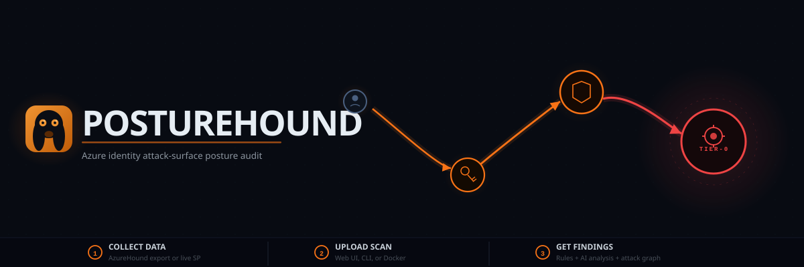
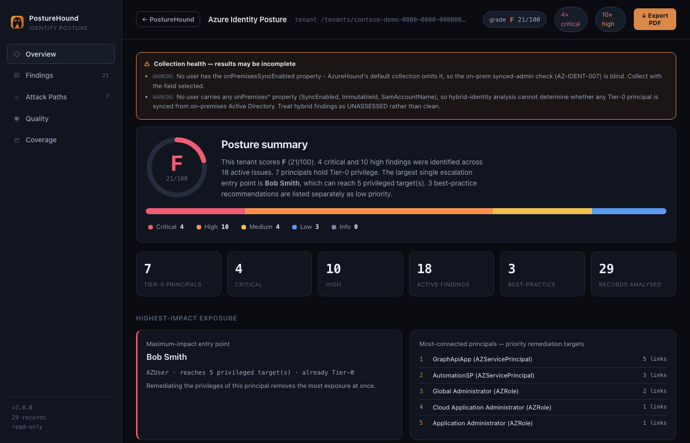
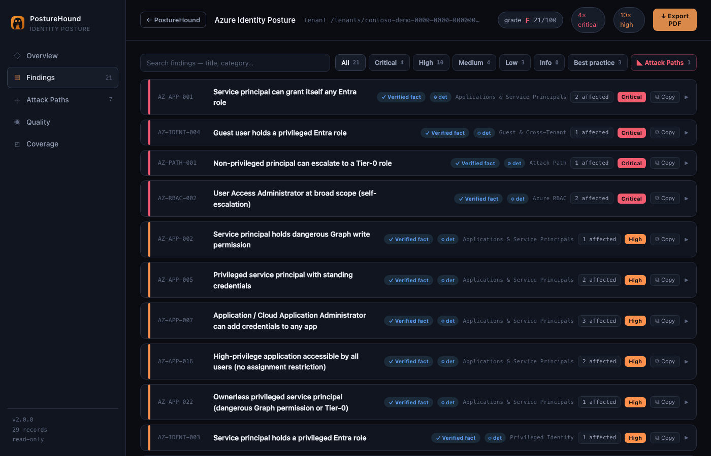
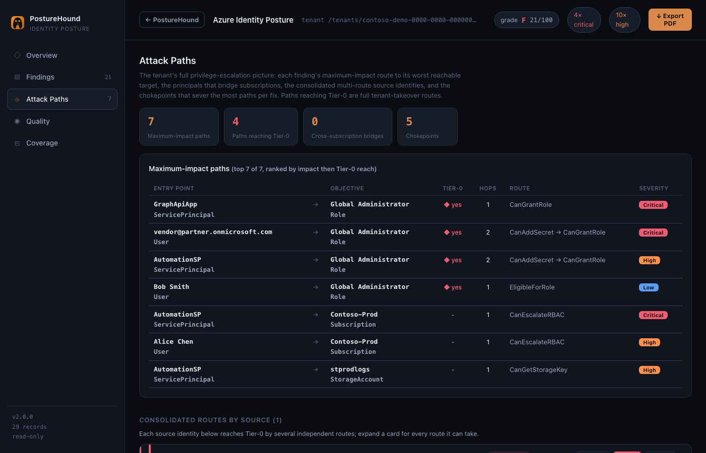
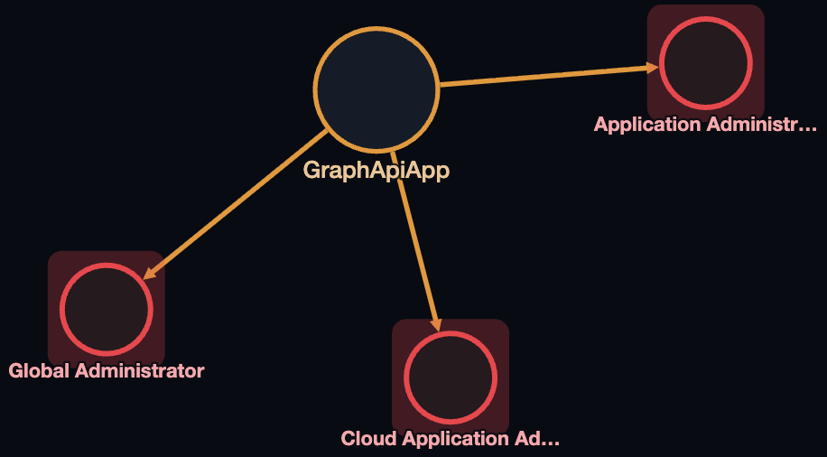

# PostureHound

Read-only Azure / Entra identity attack-surface posture audit, driven by [AzureHound](https://github.com/SpecterOps/AzureHound) collection data.

**[Documentation →](https://5t3v3.github.io/posturehound/)**

---

## Installation

### Option 1 - Docker (recommended)

Requires [Docker Desktop](https://www.docker.com/products/docker-desktop/) (Mac/Windows) or Docker Engine (Linux).

**1. Clone the repo**
```bash
git clone https://github.com/5t3v3/posturehound.git
cd posturehound
```

**2. Copy the example environment file**
```bash
cp .env.example .env
```

Edit `.env` if you want live Azure collection (fill in your Reader service-principal credentials) or AI findings (add your `ANTHROPIC_API_KEY`). Both are optional - you can upload an AzureHound file and get deterministic results without either.

**3. Start the container**
```bash
docker compose up -d --build
```

The first build takes 2-3 minutes. After that, subsequent starts are instant.

**4. Open the web UI**

Navigate to [http://127.0.0.1:31337](http://127.0.0.1:31337).

```bash
docker compose logs -f        # follow logs
docker compose down           # stop (data is preserved)
docker compose up -d          # restart without rebuilding
```

> **Data location.** Scans and settings are stored in `~/.posturehound` on your host machine, so they survive container rebuilds and `docker compose down`.

---

### Option 2 - Local Python

Requires Python 3.10+.

```bash
git clone https://github.com/5t3v3/posturehound.git
cd posturehound
pip install -r requirements.txt
uvicorn posturehound.api:app --port 31337
```

Or use the convenience scripts:
```bash
./setup.sh && ./start.sh
```

---

## Quick start

```bash
cp .env.example .env
docker compose up -d --build
```

Open **http://127.0.0.1:31337** in your browser.
Default credentials: `admin` / `posturehound` - you are prompted to change the password on first sign-in.

---

## Example output

The collection below represents a fictitious Azure tenant ("Contoso Demo") with several deliberate misconfigurations. Run it locally to see what PostureHound surfaces:

```bash
python -m posturehound.cli scan docs/demo_collection.json --format html --out report.html
```

**Overview - posture summary and highest-impact exposure**



**Findings - full finding list with severity, category and affected entities**



**Attack Paths - maximum-impact escalation routes to Tier-0**



**Attack Graph - interactive graph of escalation paths from any principal to Tier-0**



**What is in the demo tenant**

| Identity | Misconfigurations |
|----------|-------------------|
| Alice Chen (User) | Global Administrator + Subscription Owner - no PIM |
| Bob Smith (User) | PIM-eligible Global Administrator with no MFA required on activation |
| vendor@partner.onmicrosoft.com (Guest) | Cloud Application Administrator role - external account |
| AutomationSP (Service Principal) | AppRoleAssignment.ReadWrite.All + Subscription Owner + Key Vault write access |
| GraphApiApp (Service Principal) | RoleManagement.ReadWrite.Directory + Directory.ReadWrite.All, owned by Bob |
| kv-prod-secrets (Key Vault) | No network restrictions, guest and SP with broad access |
| stprodlogs (Storage Account) | Public blob access enabled, HTTP allowed |

**Score: F (21/100) - 4 Critical, 10 High, 4 Medium, 3 Low**

```
Severity breakdown
  Critical  4   Service principal self-escalation, guest with privileged role,
                attack path to Tier-0, UAA self-escalation
  High     10   Dangerous Graph permissions, standing SP credentials, weak PIM
                policy, broad RBAC, Storage key exposure
  Medium    4   Orphaned role-assignable group, Key Vault open to internet,
                public blob access, HTTP traffic allowed
  Low       3   Secret-based auth, direct role assignments, insufficient GA count
```

**Attack paths found: 7 paths, 4 reaching Tier-0**

```
Entry point                   Objective               Tier-0  Hops  Route
GraphApiApp (SP)          ->  Global Administrator     yes      1   CanGrantRole
AutomationSP (SP)         ->  Global Administrator     yes      2   CanAddSecret -> CanGrantRole
Bob Smith (User)          ->  Global Administrator     yes      1   EligibleForRole
vendor@partner (Guest)    ->  Global Administrator     yes      2   CanAddSecret -> CanGrantRole
```

**Choke points - highest-leverage remediation targets**

| Principal | Paths through | Action |
|-----------|--------------|--------|
| GraphApiApp | 5 paths (100%) | Remove RoleManagement.ReadWrite.Directory |
| AutomationSP | 3 paths (43%) | Remove AppRoleAssignment.ReadWrite.All, rotate credentials |
| Global Administrator role | 2 paths (29%) | Enforce MFA + approval on PIM activation |

**CLI output (Critical findings only)**

```
$ python -m posturehound.cli scan docs/demo_collection.json --min-severity Critical

AZ-APP-001  Critical  Service principal can grant itself any Entra role
            Entities: AutomationSP, GraphApiApp
            RoleManagement.ReadWrite.Directory lets the SP assign Global Administrator
            to itself in a single Graph API call.

AZ-IDENT-004  Critical  Guest user holds a privileged Entra role
              Entities: vendor@partner.onmicrosoft.com
              Guest identities are governed by the home tenant's controls.
              Compromise at the partner propagates directly into your tenant.

AZ-PATH-001  Critical  Non-privileged principal can escalate to a Tier-0 role
             Entities: GraphApiApp
             GraphApiApp -> Global Administrator (1 hop, CanGrantRole)

AZ-RBAC-002  Critical  User Access Administrator at broad scope (self-escalation)
             Entities: AutomationSP, Alice Chen
             Holder can assign itself Owner over the subscription then access
             all resources and managed identities.

exit code: 2  (Critical findings present - CI gate triggered)
```

---

## How to run a scan

1. **Collect** an AzureHound JSON export from your Azure tenant:
   ```bash
   azurehound list -t <tenant-id> -u <username> -p <password> -o collection.zip
   ```
   Or use live collection by setting the Reader SP credentials in `.env`.

2. **Upload** the collection file through the **New Scan** page in the web UI, or via the CLI:
   ```bash
   python -m posturehound.cli scan collection.json --format html --out report.html
   ```

3. **Review findings** on the report page. Findings are tagged by source (deterministic rule vs. AI-generated) and severity (Critical / High / Medium / Low / Informational).

---

## Findings engine

Two layers run on every scan:

**Deterministic rules (145 rules)**
Cover identity, apps/SPs, RBAC, groups, guests, Key Vault, storage, compute/managed-identity, PIM eligibility, Azure Resource Graph config, and tenant governance. Rules always run - critical patterns can never be silently missed regardless of AI availability. Browse them on the in-app **Rules** page or see [`docs/PRD.md`](docs/PRD.md).

**Two-agent AI generation** (opt-in, requires `ANTHROPIC_API_KEY`)
A **Sonnet** analyst reasons broadly over a deterministic fact pack to generate candidate findings with full reasoning chains. An **Opus** principal architect reviews those candidates, re-grades severity where warranted, rejects what does not hold up, and adds findings of its own. Every AI claim is validated against the fact pack - neither agent can fabricate an entity or relationship not present in the tenant data.

Findings from both layers are merged, deduplicated, and tagged by source (AI-generated vs. deterministic) in the report.

---

## Remediation workflow

Findings can be tracked to closure without leaving the tool:

- Set status per finding: **New / Acknowledged / In Progress / Resolved / Risk Accepted**
- **Action Plan** tab: every open finding in one prioritised list (Now / Next / Backlog by severity)
- **Scan comparison**: diff two scans to see what is resolved and what is new
- **Posture trend**: score-over-time sparkline on the Dashboard once you have more than one scan

---

## Architecture

```
AzureHound JSON -> ingest -> normalize -> derive -> rules -> score+analytics -> report / API
                  (parse)    (graph)     (abuse     (catalog) (grade, max-impact,
                                          edges)               choke points)
```

The deterministic engine is the single source of truth. Scoring, reporting, the API, and the AI layer all read from it and may not assert facts it does not contain.

| Module | Responsibility |
|--------|----------------|
| `ingest.py` | Format detection (JSON / NDJSON / zip), streaming parse, resilient skip-and-count |
| `normalize.py` | Map records into a typed `networkx` graph |
| `derive.py` | Derive abuse edges (effective roles, AddSecret, app-role / RBAC escalation, KV reach) |
| `rules/` | Detection catalog + engine with data-source gating |
| `scoring.py` | Posture score, blast-radius, maximum-impact chain, choke points |
| `report.py` | Self-contained CSP-friendly HTML report |
| `api.py` | Hardened read-only FastAPI service |
| `cli.py` | `scan` / `validate` commands |

---

## CLI reference

```bash
# Scan and print JSON
python -m posturehound.cli scan collection.json

# Produce an HTML report
python -m posturehound.cli scan collection.json --format html --out report.html

# Filter by minimum severity
python -m posturehound.cli scan collection.json --min-severity High

# Validate a collection file without scanning
python -m posturehound.cli validate collection.json
```

The `scan` command exits with code `2` if any Critical finding is present - useful for CI gating.

---

## API

```bash
uvicorn posturehound.api:app --port 8080

# GET  /            Minimal uploader UI
# POST /api/assess  Multipart file upload -> assessment JSON
# POST /api/report  Multipart file upload -> HTML report
# POST /api/validate
# GET  /health
```

---

## Library

```python
from posturehound import assess_file, assess_bytes

result = assess_file("collection.json")
# returns: { score, findings, analytics, coverage }
```

---

## Scope

PostureHound assesses the **identity attack surface** visible in AzureHound data: directory roles, RBAC, app/SP permissions, ownership, group membership, Key Vault/storage access, managed identities, and PIM eligibility.

It is **not** a full CSPM. Controls AzureHound cannot see - MFA/authentication methods, Conditional Access, sign-in/audit logs, network exposure, encryption-at-rest - are reported as **not assessable**, never as a pass. See the Coverage panel in every report.

---

## Security

PostureHound holds a tenant's full privilege map, which is sensitive. The application is built defensively:

- **Read-only / in-memory.** The API never reads server paths supplied by the user, never writes to disk, never fetches URLs, and never executes collection content.
- **Input validation.** Enforced max upload size (`PH_MAX_UPLOAD_MB`, default 50 MB). Malformed input returns a clean `400`.
- **Hardened responses.** Strict CSP (`script-src 'none'`), `nosniff`, frame-deny, `no-referrer`, `no-store`. OpenAPI docs are disabled.
- **No wildcard CORS.** Same-origin by default.

See [`docs/THREAT_MODEL.md`](docs/THREAT_MODEL.md).

---

## Data model caveat

AzureHound's relationship representation varies by version. The loader field mappings in `normalize.py` are pragmatic and should be **validated against your AzureHound version** before relying on results. See [`docs/DATA_MODEL.md`](docs/DATA_MODEL.md).
